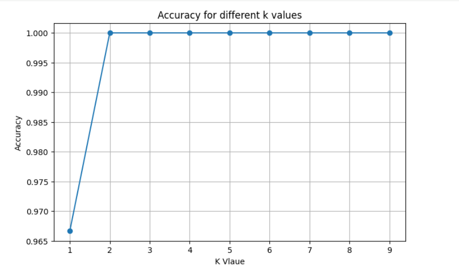
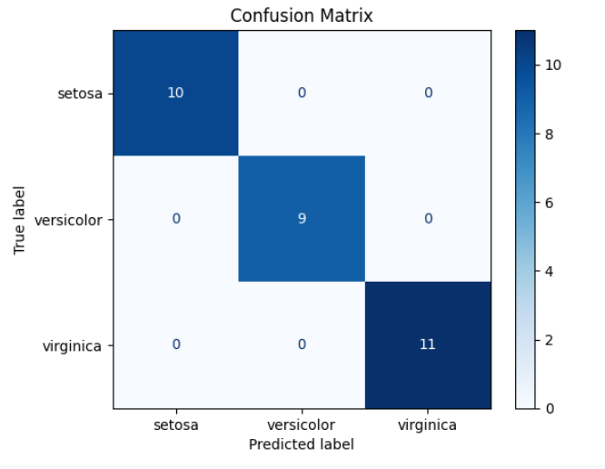
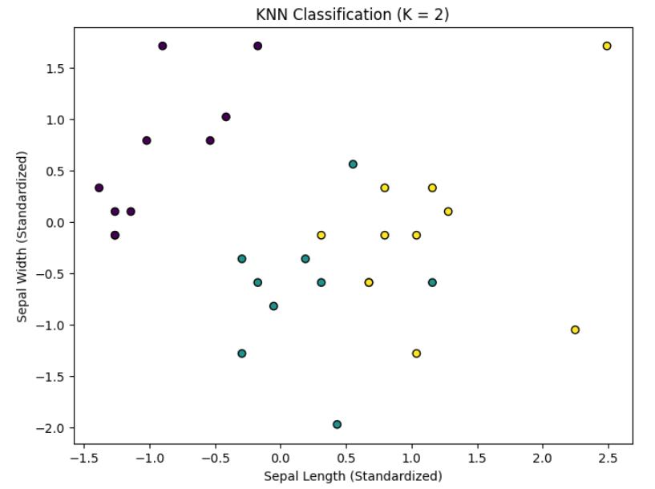

# ElevateLabs-Task6

## Task
K-Nearest Neighbors (KNN) Classification

## Objective
Implement the K-Nearest Neighbors (KNN) algorithm to classify Iris flower species and evaluate its performance.

## Dataset
- Iris Dataset (Scikit-learn)

## Tools Used
- Python
- Pandas
- Matplotlib
- Scikit-learn

## Steps Performed
1. Loaded the Iris dataset.
2. Normalized the features using `StandardScaler`.
3. Trained a K-Nearest Neighbors (KNN) classifier.
4. Experimented with different values of **K**.
5. Evaluated the model using **Accuracy** and **Confusion Matrix**.
6. Visualized the classification results.

## Results
- Identified the optimal value of **K** based on model accuracy.
- Achieved high classification accuracy on the test dataset.

## Repository Structure

```
ElevateLabs-Task6/
│
├── ElevateLabsTask6.ipynb
├── README.md
└── Screenshots/
    ├── accuracy_vs_k.png
    ├── confusion_matrix.png
    └── knn_classification.png
```

## Screenshots

### Accuracy vs K


### Confusion Matrix


### KNN Classification

